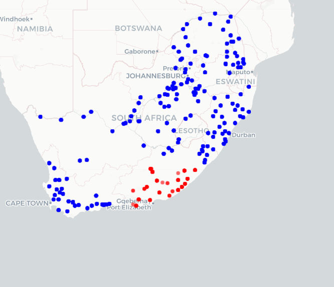

# AquaSight — Water Quality Prediction from Space

**EY Open Science AI & Data Challenge 2026 — 2nd Runner-Up (Top 3 of 24,000+ teams, 146 countries)**

[](docs/Model_Description.md)
[](#our-result)
[](#the-competition)
[](LICENSE)

**Team:** [Modeste SAVADOGO](https://github.com/modestesavadogo) & Mamadou Tahirou DIALLO — Data & AI Engineering, INPT Rabat, Morocco

> **Note on scope:** This repository documents our competition result, methodology, and pipeline structure in full. The exact per-target feature lists, feature engineering formulas, model hyperparameters, and ensemble blend weights have been **redacted** (replaced with clearly-marked placeholders in the notebooks and a generalized description in `docs/Model_Description.md`), since this work underlies ongoing research we intend to continue. Everything needed to understand *how* the pipeline works is here — the exact competitive recipe is not.

---

## Table of Contents

1. [The Competition](#the-competition)
2. [The Problem](#the-problem)
3. [Our Result](#our-result)
4. [Repository Structure](#repository-structure)
5. [Approach Overview](#approach-overview)
6. [Quickstart](#quickstart)
7. [Data Sources](#data-sources)
8. [Modeling Journey](#modeling-journey)
9. [Final Architecture](#final-architecture)
10. [Key Findings & Lessons Learned](#key-findings--lessons-learned)
11. [Documents](#documents)
12. [Reproducibility Notes](#reproducibility-notes)
13. [Citation](#citation)
14. [License](#license)
15. [Acknowledgements](#acknowledgements)

---

## The Competition

The **[EY Open Science AI & Data Challenge](https://www.ey.com/en_gl/university-relationships/open-science-data-challenge)** is EY's global annual competition inviting university students worldwide to apply AI and open data to pressing sustainability problems. The **2026 edition** focused on **water security in South Africa**, one of the most water-stressed countries in the world, and asked participants to predict water quality indicators purely from freely available satellite and environmental data — without any physical sample collection.

- **Field:** 24,000+ teams, 146 countries
- **Task:** Predict three water quality indicators at monitoring stations across South Africa using only open remote-sensing and environmental data (no in-situ chemistry measurements as input)
- **Evaluation metric:** Mean R² across the three targets, on a held-out submission set of stations
- **Our result:** **R² = 0.4829**, placing our team **2nd Runner-Up** (3rd overall) — one of five global finalists selected for the final presentation round

## The Problem

South Africa's water crisis is severe and unevenly monitored:

- Only 26 of 958 water supply systems met Blue Drop certification in the 2023 DWS Blue Drop Report (down from 44 in 2014)
- 277 systems (29%) are in a critical state; 46% fail microbiological compliance
- The 2023 Hammanskraal cholera outbreak killed 23 people
- 42% of rural households lack consistent access to clean water and rely on unprotected rivers and wells
- Physical monitoring infrastructure is geographically uneven — **entire coastal regions have essentially no ground-truth stations**

Conventional monitoring requires field teams to physically visit each station, collect samples, and wait for lab results — a process that is slow, costly, and impossible to scale to national coverage. **AquaSight** predicts water chemistry continuously, at national scale, and at near-zero marginal cost, using satellite imagery and climate data that already exists and is free to access.

### Targets

| Target | Description | Statistical character |
|---|---|---|
| **Total Alkalinity (TA)** | Buffering capacity of water against acidification | Roughly bimodal, geology-driven |
| **Electrical Conductance (EC)** | Proxy for dissolved ion concentration / salinity | Spans 3 orders of magnitude, tracks aridity |
| **Dissolved Reactive Phosphorus (DRP)** | Bioavailable phosphorus, key eutrophication driver | Right-skewed, event-driven by agricultural runoff |

### The core difficulty: spatial generalization

The defining challenge of this dataset is not raw predictive power — it's that **submission stations are clustered along the southern Cape coast, while training stations are distributed across the entire country**. The model cannot lean on nearby labeled examples; it has to learn the underlying physical processes (climate regime, terrain, soil, land use) that drive water chemistry and transfer those relationships to an unseen region. Standard k-fold cross-validation is misleadingly optimistic here, since spatial autocorrelation between folds inflates apparent performance relative to true leaderboard generalization. This single insight shaped every later modeling decision — see [Modeling Journey](#modeling-journey).



*Training stations (blue) are distributed nationwide; submission stations (red) are clustered along the southern Cape coast — an unseen region the model must generalize to without any nearby labeled examples.*

## Our Result

| Metric | Value |
|---|---|
| Leaderboard mean R² | **0.4829** |
| Final rank | **2nd Runner-Up** (Top 3 of 24,000+ teams / 146 countries) |
| Training stations | 162 (nationwide) |
| Submission stations | 24 (southern Cape coast, geographically unseen) |
| Training observations | 9,319 (2013–2015) |
| Final feature count | curated per-target subset of 108 engineered candidates (exact counts redacted) |

## Repository Structure

```
ey-ai-data-challenge-2026-aquasight/
│
├── README.md                              ← you are here
├── LICENSE
├── CITATION.cff
├── requirements.txt
│
├── notebooks/                             ← run in numeric order
│   ├── 00_modeling_journey_narrative.ipynb   informational — documents the 4-phase R&D arc
│   ├── 01_feature_extraction.ipynb           Step 1 · pulls features from 5 remote-sensing/climate sources
│   ├── 02_preprocessing.ipynb                Step 2 · EDA, imputation, feature engineering
│   ├── 03_modeling.ipynb                     Step 3 · training, SHAP, final submission
│   └── extras/
│       ├── landsat_data_extraction.ipynb     standalone Landsat extraction (Microsoft Planetary Computer)
│       └── terraclimate_data_extraction.ipynb standalone TerraClimate extraction (Google Earth Engine)
│
├── data/
│   ├── raw/                               original challenge files
│   │   ├── water_quality_training_dataset.csv
│   │   └── submission_template.csv
│   ├── external/                          third-party benchmark features + shapefile
│   │   ├── landsat_features_{training,validation}.csv
│   │   ├── terraclimate_features_{training,validation}.csv
│   │   └── ne_10m_coastline/               Natural Earth 10m coastline shapefile (public domain)
│   ├── interim/                           intermediate outputs from Step 1 (pre-final-merge)
│   │   ├── final_training_with_ee_features.csv
│   │   └── submission_with_environmental_features.csv
│   ├── enriched/                          Step 1 final output (all 5 sources merged)
│   │   ├── training_with_ee_features_enriched_.csv
│   │   └── submission_enriched_.csv
│   ├── processed/                         Step 2 output — ready for modeling
│   │   ├── train_preprocessed.csv
│   │   └── submission_preprocessed.csv
│   └── submission/
│       └── final_submission.csv           our final competition submission
│
└── docs/
    ├── Model_Description.md               full technical writeup (methodology, architecture, findings)
    ├── station_distribution_map.png       train vs. submission station distribution (spatial generalization gap)
    ├── ey_challenge_banner.png  
    └── EY_challenge_2026_winners.jpg       official results photo
```

## Approach Overview

```
┌───────────────────────────────────────────────────────────────────────┐
│  STEP 1 — Feature Extraction  (notebooks/01_feature_extraction.ipynb) │
│  5 open data sources → merged on (Latitude, Longitude, Sample Date)   │
└───────────────────────────────────┬───────────────────────────────────┘
                                     ▼
┌───────────────────────────────────────────────────────────────────────┐
│  STEP 2 — Preprocessing  (notebooks/02_preprocessing.ipynb)           │
│  5-level hierarchical imputation · distance-to-sea · feature          │
│  engineering (cyclical encoding, rolling precipitation windows,       │
│  climate regime bins, physical interaction terms)                    │
└───────────────────────────────────┬───────────────────────────────────┘
                                     ▼
┌───────────────────────────────────────────────────────────────────────┐
│  STEP 3 — Modeling  (notebooks/03_modeling.ipynb)                     │
│  Independent per-target ensembles · SHAP explainability ·             │
│  final_submission.csv                                                 │
└───────────────────────────────────────────────────────────────────────┘
```

## Quickstart

```bash
git clone https://github.com/modestesavadogo/ey-ai-data-challenge-2026-aquasight.git
cd ey-ai-data-challenge-2026-aquasight
pip install -r requirements.txt
```

**Note:** `notebooks/02_preprocessing.ipynb` and `notebooks/03_modeling.ipynb` contain clearly-marked placeholder cells where the exact feature engineering formulas, hyperparameters, and ensemble blend weights were redacted (see the scope note above). Running the notebooks as-is will execute end-to-end and produce a valid submission-shaped output, but **will not reproduce the exact R² = 0.4829 result** — that requires the original (unpublished) feature/model configuration. The `data/` folder still contains the real, unredacted feature matrices and our actual `final_submission.csv`, so the full result is verifiable from the data alone even though the modeling code that produced it is genericized here.

**To explore the pipeline structure:** open the notebooks in order (`01` → `02` → `03`) to see the data assembly, preprocessing, and modeling flow. `data/enriched/` and `data/processed/` already contain the real outputs of Steps 1–2, so you can inspect the actual feature matrix at any stage without running the redacted cells.

**To run Step 1 from scratch:** `notebooks/01_feature_extraction.ipynb` is unredacted and requires a free [Google Earth Engine](https://earthengine.google.com/) account (Pipelines B, C, D query GEE directly) — see [Reproducibility Notes](#reproducibility-notes). Runtime: 2–6 hours depending on GEE quota.

## Data Sources

Every feature comes from freely available, open remote-sensing and climate data — **no proprietary or paid data was used**.

| Source | Access | Type | Key features |
|---|---|---|---|
| **Landsat 8/9** | Microsoft Planetary Computer | Dynamic, per-date | `nir`, `green`, `swir16`, `swir22`, `NDMI`, `MNDWI`, `NBR`, moisture ratios |
| **TerraClimate / ERA5-Land** | Google Earth Engine | Dynamic, per-date | `precip_7d_sum`, `precip_30d_sum`, `pet`, `soil_moist_top/deep`, `runoff`, `evaporation` |
| **SRTM / OpenLandMap / MODIS** | Google Earth Engine | Static, per-location | `elevation`, `slope`, `aspect`, `soil_ph`, `soil_clay`, `soil_carbon`, `veg_index` |
| **SoilGrids-ISRIC / MERIT Hydro / CSP** | Google Earth Engine | Static, per-location | `soil_cec`, `soil_soc`, `twi` (topographic wetness index), `human_mod` |
| **ESA WorldCover / WorldPop** | Google Earth Engine | Mixed | `ag_pct`, `urban_pct`, `forest_pct`, `water_pct`, `pop_density_3km` |
| **Natural Earth** | Public domain shapefile | Static | 10m coastline, used to compute distance-to-sea |

Static (terrain/soil/land-cover) features are extracted once per unique station location; dynamic features are extracted per observation row, filtered to the correct imagery window by sample date. All merges use `(Latitude, Longitude, Sample Date)` as a composite key to guarantee row-level correctness — full detail in [`docs/Model_Description.md`](docs/Model_Description.md).

## Modeling Journey

We iterated through four strategies, each motivated by lessons from the last. Full narrative in [`notebooks/00_modeling_journey_narrative.ipynb`](notebooks/00_modeling_journey_narrative.ipynb).

| Phase | Strategy | Result | Takeaway |
|---|---|---|---|
| **1** | Standard K-fold CV, Random Forest / GBM, per-target split | R² ≈ 0.38–0.42 | Spatial autocorrelation between folds inflated CV scores — revealed the generalization gap |
| **2** | Geographic station selection (BallTree haversine nearest-neighbor filtering) | No gain | Losing training volume outweighed any distributional alignment benefit |
| **3** | Distance-weighted training + station-level dropout CV (`run_dropout_cv`, 15–20 rounds) | R² ≈ 0.45 | Real but modest gain — weighting alone can't bridge the interior/coastal distributional gap |
| **4** | Full data + rich physically-motivated feature engineering + per-target ensembles | **R² = 0.4829** | Features that encode *physical processes* (not raw coordinates) transfer across geography |

## Final Architecture

Each target uses an ensemble matched to its own driver structure:

| Target | Ensemble |
|---|---|
| **Total Alkalinity** | ExtraTrees + RandomForest + HistGradientBoosting (weighted blend) |
| **Electrical Conductance** | RandomForest + XGBoost + HistGradientBoosting (weighted blend) |
| **Dissolved Reactive Phosphorus** | RandomForest (standalone) |

*(Exact blend weights, hyperparameters, and feature sets are redacted — see the scope note above.)*

- ExtraTrees' high variance tolerance suits TA's bimodal distribution.
- XGBoost's regularization helps EC, which spans a very wide dynamic range.
- DRP's skew and event-driven nature made ensembling less stable than one well-tuned Random Forest.
- All predictions are clipped to zero (concentrations cannot be negative).
- Feature sets (35 for DRP, up to 42 for EC) were selected via recursive feature addition validated on the leaderboard, plus domain-knowledge pruning.

Full technical detail — including the imputation cascade, distance-to-sea decay transform, and the complete feature engineering catalogue — is in [`docs/Model_Description.md`](docs/Model_Description.md).

## Key Findings & Lessons Learned

- **The geography gap is the whole game.** No spatial sampling or reweighting strategy closed it — the real gains came from features encoding the *physical processes* driving water chemistry (precipitation antecedent conditions, terrain-driven runoff, climate regime), which transfer regardless of location.
- **Standard k-fold CV is the wrong validation scheme** for spatially clustered submission sets. Leave-Location-Out CV or spatial blocking would give an honest read on generalization during development instead of only on the leaderboard.
- **Replacing raw GPS coordinates with physically-derived features** (topographic wetness index, marine influence decay, precipitation rolling windows, climate regime bins) was the single highest-impact modeling decision.
- **With more time**, natural next steps are: a spatial meta-learner stack (station-coordinate-aware second-level model), Bayesian hyperparameter optimization (Optuna), and semi-supervised distribution alignment using submission-station feature distributions (without their labels).

## Documents

| Document | Description |
|---|---|
| [`docs/Model_Description.md`](docs/Model_Description.md) | Full technical methodology writeup |
| [`docs/station_distribution_map.png`](docs/station_distribution_map.png) | Train vs. submission station distribution map (the spatial generalization gap) |
| [`docs/EY_challenge_2026_winners.jpg`](docs/EY_challenge_2026_winners.jpg) | Official results photo |

## Reproducibility Notes

- **Python 3.9+** required (developed on 3.11).
- Pipelines B, C, D of `01_feature_extraction.ipynb` require a free [Google Earth Engine](https://earthengine.google.com/) account and a Google Cloud project with the Earth Engine API enabled. Update the `GEE_PROJECT` variable in that notebook before running.
- Pipeline A (Landsat/TerraClimate) reads pre-computed CSVs directly — no API key required for that pipeline.
- All intermediate artifacts (`data/interim/`, `data/enriched/`, `data/processed/`) are committed so any stage of the pipeline can be verified independently without re-running upstream API calls.
- All hyperparameters and pipeline settings are fixed at their final competition values.

## Citation

If you reference this work, please cite:

```bibtex
@misc{aquasight2026,
  title  = {AquaSight: Physics-Informed Machine Learning for Water Quality
            Prediction Across South African River Catchments},
  author = {Savadogo, Modeste and Diallo, Mamadou Tahirou},
  year   = {2026},
  note   = {2nd Runner-Up, EY Open Science AI \& Data Challenge 2026},
  url    = {https://github.com/modestesavadogo/ey-ai-data-challenge-2026-aquasight}
}
```

See also [`CITATION.cff`](CITATION.cff).

## License

Code in this repository is released under the [MIT License](LICENSE). Data files retain the licenses of their original providers:

- Natural Earth coastline shapefile — public domain
- Landsat 8/9 (via Microsoft Planetary Computer) — U.S. Geological Survey, open access
- TerraClimate, SRTM, MODIS, SoilGrids, ESA WorldCover, WorldPop, ERA5-Land, MERIT Hydro (via Google Earth Engine) — open access under their respective source licenses
- Original challenge labels (`water_quality_training_dataset.csv`, `submission_template.csv`) — provided by EY for the purposes of the 2026 Open Science AI & Data Challenge

## Acknowledgements

Built by **Modeste Savadogo** and **Mamadou Tahirou Diallo**, Data & AI Engineering students at [INPT Rabat](https://inpt.ac.ma), Morocco, for the **EY Open Science AI & Data Challenge 2026**. Thanks to the EY Open Science team and mentors for organizing a challenge grounded in a genuinely urgent, underserved problem.
